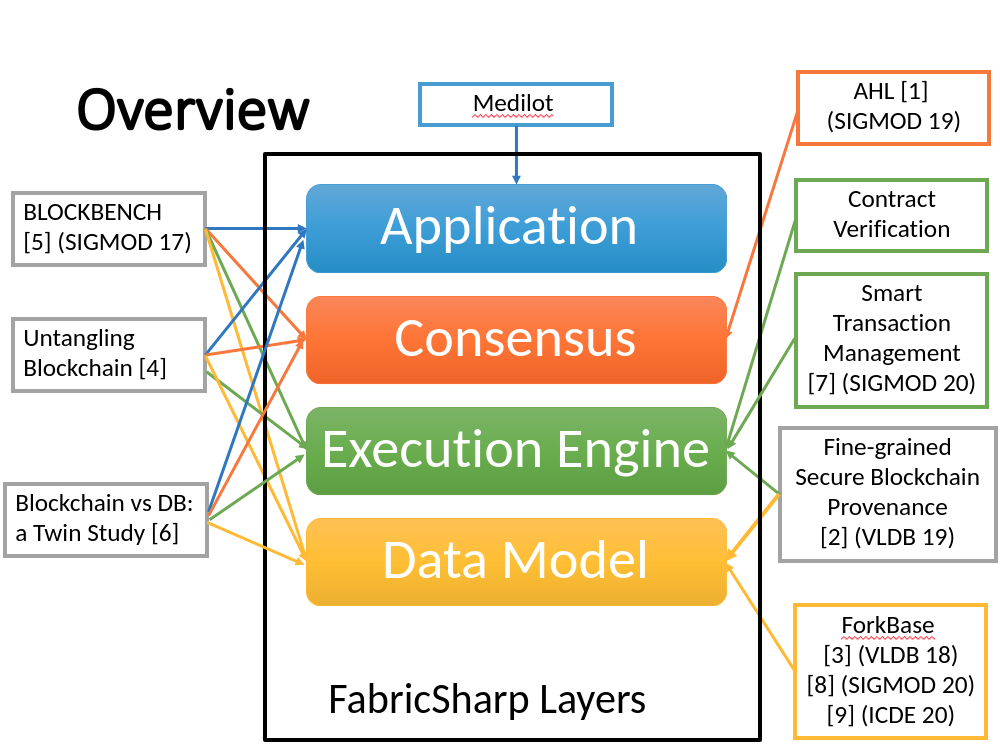

# Overview
FabricSharp (hash)  project is a variant of Hyperledger Fabric 2.2, a permissioned blockchain platform from Hyperledger. 
Compared with the vanilla version, FabricSharp supports fine-grained secure data provenance, sharding, smart transaction management, use of
trusted hardware (eg. SGX), and a blockchain native storage engine called ForkBase, to boost system performance.

Thanks to colleagues from [MediLOT](https://medilot.com), [NUS](https://www.comp.nus.edu.sg/~dbsystem/index.html), [SUTD](https://istd.sutd.edu.sg/people/faculty/dinh-tien-tuan-anh), [BIT](http://cs.bit.edu.cn/szdw/jsml/js/zmh/index.htm), [Zhejiang University](https://person.zju.edu.cn/0098112), [MZH Technologies](http://www.mzhtechnologies.com/) and other organizations for their contributions.

# Quick Start
* Build the peer docker image
```
make peer-docker # Will build an image hyperledger/fabric-sharp-peer:2.2.0
```
* Build the orderer docker image
```
make orderer-docker # Will build an image hyperledger/fabric-sharp-orderer:2.2.0
```

If `docker run hyperledger/fabric-sharp-peer:2.2.0 peer version` shows a line of `Version: 2.2.0(SHARP)`, then the building process is successful. And so is the orderer image. 

__NOTE__: FabricSharp relies on ForkBase[3] as the storage engine, which is close-sourced.
Hence FabricSharp can only be built and run within the docker container. 

# Architecture


# Usage
## Provenance-dependent Smart Contract
This [chaincode](provenance_chaincode/token) demonstrates a Golang contract on token management. It captures and queries the provenance information. 
Note that we instrument the original *shim* package for the provenance managenent. So the imported package is our `github.com/RUAN0007/fabric-chaincode-go`, instead of the official `github.com/hyperledger/fabric-chaincode-go`. 

## Smart Scheduler
We require users to set bash environment variable `$CC_TYPE` for each run of `orderer` and `peer`. 
There are five optional value for `$CC_TYPE`, each corresponding to a transaction scheduler described in branch __sigmod20__. 
* `original`: the original FIFO scheduler
* `fpp`: the scheduler proposed by [Fabric++](https://arxiv.org/abs/1810.13177).
* `occ-standard`: one of the schedulers migrated from the OCC database
* `occ-latest`: one of the schedulers migrated from the OCC database
* `occ-sharp`: our state-of-the-art scheduler. 

## DB type
We add two options for `STATEDATABASE`: `Provleveldb` and `UstoreDB`. Both support provenance-dependent smart contracts and five schedulers. `Provleveldb` extends the existing leveldb to store the data provenance. `Ustoredb` relies on ForkBase.
FabricSharp is compatible with the existing two options: `goleveldb` and `CouchDB`. But both do not support provenance management. And both are only compatible with `original` scheduler. 

To work with any `occ-*`-typed scheduler, users must set a directory path `$MV_STORE_PATH` for the LevelDB instance. 
The instance implements the multi-versioned storage, used to compute the transaction dependency. 
The directory will be emptied every time that the docker container runs

When `CC_TYPE=occ-sharp`, users may set `$TXN_SPAN_LIMIT` to restrict the max block span of a transaction. By default, it is 10. 

For any cases, users can optionally control the block size by setting `$BLOCK_SIZE`. Otherwise, the transactions per block is configured at _configtx.yaml_. 

# Progress
The current master branch incorporates the optimization from [2] and [7] on the basis of Fabric v2.2.0. 
We dedicate another branch __vldb19__, which, based on v1.3.1, shows more details only about [2], including the experimental baseline, scripts, chaincode examples and so on. 
Similarly, branch __sigmod20__, also based on v1.3.1, is dedicated for [7]. 

We will soon merge the optimization in [1] to this master branch and similarly dedicate another branch for [1]. 

[Previous Official Readme](README_old.md)

# Papers. 
* [1] H. Dang, A. Dinh, D. Lohgin, E.-C. Chang, Q. Lin, B.C. Ooi: [Towards Scaling Blockchain Systems via Sharding](https://arxiv.org/pdf/1804.00399.pdf). ACM SIGMOD 2019
* [2] P. Ruan, G. Chen, A. Dinh, Q. Lin, B.C. Ooi, M. Zhang: [FineGrained, Secure and Efficient Data Provenance on Blockchain Systems](https://www.comp.nus.edu.sg/~ooibc/bcprovenance.pdf). VLDB 2019.  [The morning paper](https://blog.acolyer.org/2019/09/16/blockchain-provenance/) review.
* [3] S. Wang, T. T. A . Dinh, Q. Lin, Z. Xie, M. Zhang, Q. Cai, G. Chen, B.C. Ooi, P. Ruan: [ForkBase: An Efficient Storage Engine for Blockchain and Forkable Applications](https://www.comp.nus.edu.sg/~ooibc/forkbase.pdf). VLDB 2018.  [The morning paper](https://blog.acolyer.org/2018/06/01/forkbase-an-efficient-storage-engine-for-blockchain-and-forkable-applications/) review.
* [4] A. Dinh, R. Liu, M. Zhang, G. Chen, B.C. Ooi, J. Wang: [Untangling Blockchain: A Data Processing View of Blockchain Systems](https://ieeexplore.ieee.org/stamp/stamp.jsp?arnumber=8246573). IEEE Transactions on Knowledge and Data Engineering, July 2018. 
* [5] A. Dinh, J. Wang, G. Chen, R. Liu, B. C. Ooi, K.-L. Tan: [BLOCKBENCH: A Framework for Analysing Private Blockchains](https://www.comp.nus.edu.sg/~ooibc/blockbench.pdf). ACM SIGMOD 2017. [The morning paper](https://blog.acolyer.org/2017/07/05/blockbench-a-framework-for-analyzing-private-blockchains/) review.
* [6] P. Ruan, G. Chen, A. Dinh, Q. Lin, D. Loghin, B. C. Ooi, M. Zhang: [Blockchains and Distributed Databases: a Twin Study](https://arxiv.org/pdf/1910.01310.pdf). 2019.
* [7] P. Ruan, D. Loghin, Q.-T. Ta, M Zhang, G. Chen, B. C. Ooi: [A Transactional Perspective on Execute-Order-Validate Blockchains](https://arxiv.org/pdf/2003.10064.pdf), ACM SIGMOD 2020.
* [8] C. Yue.  Z. Xue, M. Zhang, G. Chen, B. C. Ooi, S. Wang, X. Xiao: [Analysis of Indexing Structures for Immutable Data](https://arxiv.org/pdf/2003.02090.pdf). ACM SIGMOD 2020.
* [9] Q. Lin et al. ForkBase: Immutable, [Tamper-evident Storage Substrate for Branchable Applications](https://www.comp.nus.edu.sg/~ooibc/icde20forkbase.pdf). IEEE International Conference on Data Engineering, 2020
* [10] P. Ruan, A. Dinh, Q. Lin, M. Zhang, G. Chen, B. C. Ooi: [Revealing Every Story of Data in Blockchain Systems](https://www.comp.nus.edu.sg/~ooibc/sigmodhighlight2020.pdf). ACM SIGMOD Highlight Award paper, 2020.